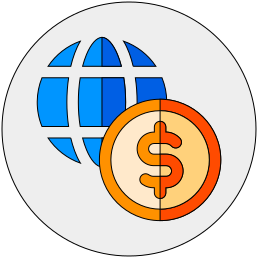

# Craft Forex

Craft 3 plugin that converts currency using Rapid API + local storage. Based on Currency Converter by @leowebguy.



&nbsp;

---

### Installation

Open your terminal and go to your Craft project:

```bash
cd /path/to/project
```

Then tell Composer to load the plugin:

```bash
composer require kerns/craft-forex
```

In the Control Panel, go to Settings → Plugins and click the “Install” button for Craft Forex.

Go to [rapidapi.com/natkapral/api/currency-converter5](https://rapidapi.com/natkapral/api/currency-converter5/) → Get your Free API Key

In the Control Panel, go to Settings → Craft Forex and save your API Key


&nbsp;

---

### Usage

```twig

{{ craft.currency.conversion('USD', 'EUR', amount) }}
```

Also passing number as string:

```twig
{{ craft.currency.conversion('USD', 'EUR', 23) }}
```
