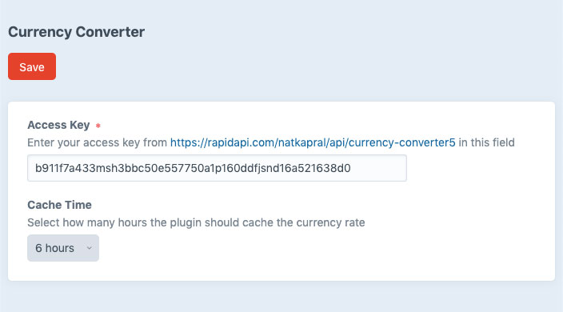

# Currency Converter plugin for Craft 3

Craft 3 plugin that converts currency using API & local storage 

### IMPORTANT

_Craft 3_

```json
"require": {
   "leowebguy/craft-currency-converter": "1.0.3",
}
```

_Craft 4_

```json
"require": {
   "leowebguy/craft-currency-converter": "^1.0.4",
}
```

---

### Installation

Open your terminal and go to your Craft project:

```bash
cd /path/to/project
```

Then tell Composer to load the plugin:

```bash
composer require leowebguy/craft-currency-converter
```

In the Control Panel, go to Settings → Plugins and click the “Install” button for Currency Converter.

Go to [rapidapi.com/natkapral/api/currency-converter5](https://rapidapi.com/natkapral/api/currency-converter5/) → Get your Free API Key

In the Control Panel, go to Settings → Currency Converter and save your API Key



&nbsp;

---

### Usage

The plugin exposes a Currency Converter's methods:

```twig

{{ craft.currency.conversion('USD', 'EUR', amount) }}
```

Also passing number as string:

```twig
{{ craft.currency.conversion('USD', 'EUR', 23) }}
```
